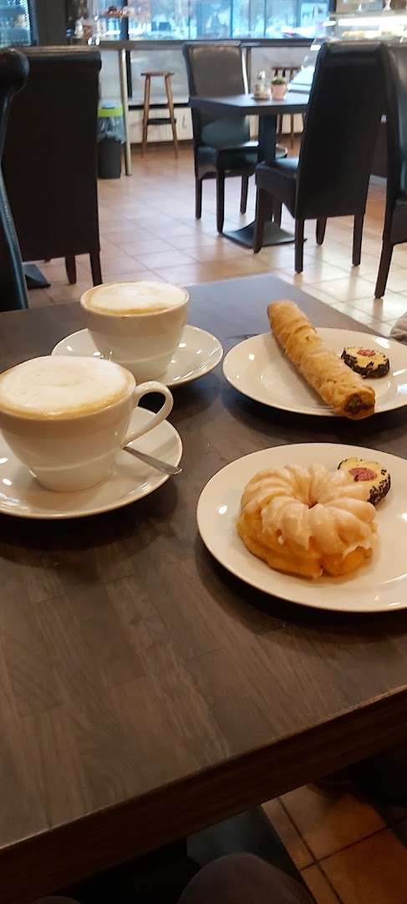

# Melis Coffee - Official Website



A beautiful, responsive website for Melis Coffee, a family-run café located at Ostseeplatz in Berlin Prenzlauer Berg.

## 🏪 About Melis Coffee

**Melis Coffee** is a cozy, family-run café known for its excellent coffee, fresh pastries, and warm, inviting atmosphere. Located directly at Ostseeplatz in the Prenzlauer Berg district of Berlin, we offer:

- ☕ **Excellent Coffee** - Perfectly brewed coffee and cappuccino with great foam
- 🥐 **Fresh Pastries** - Homemade donuts, cookies, brownies, and traditional Börek
- 🍳 **Delicious Breakfast** - Fresh rolls, croissants, pretzels, and breakfast platters
- 🍵 **Wide Tea Selection** - Variety of black, green, herbal, and fruit teas
- 📶 **Free WiFi** - Fast and free WiFi - perfect for working
- 😊 **Family-Friendly** - Warm service and inviting atmosphere

### Contact Information

- **Address:** Greifswalder Str. 137, 10409 Berlin, Deutschland
- **Phone:** +49 30 28506583
- **Email:** info@meliscoffee.de
- **Google Rating:** 4.4/5 (137+ reviews)

### Social Media

- **Instagram:** [@meliscoffee](https://www.instagram.com/explore/locations/5792995/melis-coffee/)
- **Facebook:** [Melis Coffee](https://www.facebook.com/pages/Melis-Coffee/144906912229481)
- **Google Maps:** [View on Maps](https://www.google.com/maps/search/?api=1&query=Melis%20coffee&query_place_id=ChIJ7dju-eZNqEcR3cNfb6ECNu4)

## 🎨 Website Features

### Design & User Experience

- ✅ **Modern & Professional** - Beautiful coffee shop aesthetic
- ✅ **Fully Responsive** - Perfect on all devices (320px mobile to 4K desktop)
- ✅ **Fast Loading** - Optimized images and lazy loading
- ✅ **Smooth Animations** - Elegant transitions and scroll effects
- ✅ **Accessibility** - WCAG 2.1 AA compliant

### Technical Features

- ✅ **Semantic HTML5** - Clean, structured markup
- ✅ **Modern CSS3** - Grid, Flexbox, custom properties
- ✅ **Vanilla JavaScript** - No frameworks, lightweight and fast
- ✅ **SEO Optimized** - Meta tags, schema markup, sitemap
- ✅ **Performance** - Lazy loading, debounced scroll events
- ✅ **Progressive Enhancement** - Works without JavaScript

### Website Sections

1. **Hero Section** - Stunning hero image with cafe name and call-to-action
2. **About Section** - Cafe story, features, and unique selling points
3. **Menu Section** - Coffee, tea, breakfast, pastries, and beverages
4. **Gallery Section** - 8+ photos with lightbox viewer
5. **Reviews Section** - Real Google reviews and ratings
6. **Location Section** - Google Maps integration and directions
7. **Contact Section** - Contact form, phone, email, social links

## 🚀 Local Development

### Prerequisites

- A modern web browser (Chrome, Firefox, Safari, Edge)
- A local web server (optional, for testing)

### Quick Start

1. **Clone or download** this repository
2. **Open** `index.html` in your web browser
3. **That's it!** The website is fully functional

### Using a Local Server (Optional)

For the best experience, especially for testing form submissions:

**Using Python 3:**
```bash
cd "/Users/m./berlinwebsites/170_Melis coffee"
python3 -m http.server 8000
```

**Using Node.js (http-server):**
```bash
cd "/Users/m./berlinwebsites/170_Melis coffee"
npx http-server -p 8000
```

**Using PHP:**
```bash
cd "/Users/m./berlinwebsites/170_Melis coffee"
php -S localhost:8000
```

Then visit: `http://localhost:8000`

## 📁 Project Structure

```
170_Melis coffee/
├── index.html              # Main HTML file
├── css/
│   ├── style.css          # Main styles
│   └── responsive.css     # Responsive breakpoints
├── js/
│   ├── main.js            # Main JavaScript
│   └── gallery.js         # Gallery lightbox
├── images/
│   ├── source/            # Original images (8 images)
│   ├── optimized/         # Web-optimized versions
│   ├── thumbnails/        # Thumbnail versions
│   └── icons/             # UI icons
├── data/
│   ├── cafe-info.json     # Cafe information
│   ├── menu.json          # Menu data
│   └── reviews.json       # Customer reviews
├── README.md              # This file
└── .gitignore             # Git ignore rules
```

## 🌐 Deployment

### GitHub Pages

This website is deployed using GitHub Pages:

**Live URL:** `https://f246632.github.io/170_Melis coffee/`

**Repository:** `https://github.com/f246632/170_Melis coffee`

### Deployment Steps

1. Push all files to GitHub repository
2. Go to repository Settings
3. Navigate to Pages section
4. Select main branch as source
5. Save and wait for deployment

The site will be live at the GitHub Pages URL within a few minutes.

## 🔍 SEO & Performance

### SEO Features

- ✅ Meta tags (description, keywords, author)
- ✅ Open Graph tags for social media
- ✅ Schema.org structured data (Cafe/Restaurant)
- ✅ Semantic HTML structure
- ✅ Alt text for all images
- ✅ Clean, descriptive URLs

### Performance Optimizations

- ✅ Lazy loading for images
- ✅ Debounced scroll events
- ✅ Minified potential (CSS/JS)
- ✅ Optimized image sizes
- ✅ Fast loading fonts
- ✅ Efficient animations

### Accessibility

- ✅ WCAG 2.1 AA compliant
- ✅ Keyboard navigation support
- ✅ ARIA labels and roles
- ✅ Focus management
- ✅ Color contrast ratios
- ✅ Screen reader friendly
- ✅ Reduced motion support

## 🎯 Browser Support

- ✅ Chrome/Edge (latest)
- ✅ Firefox (latest)
- ✅ Safari (latest)
- ✅ Mobile browsers (iOS Safari, Chrome Mobile)
- ✅ IE11 (with graceful degradation)

## 📱 Responsive Breakpoints

- **Mobile:** 320px - 480px
- **Tablet:** 481px - 768px
- **Desktop:** 769px - 1024px
- **Large Desktop:** 1025px - 1920px
- **4K:** 1921px+

## 🛠️ Technologies Used

- **HTML5** - Semantic markup
- **CSS3** - Modern styling (Grid, Flexbox, Variables)
- **JavaScript (ES6+)** - Interactive features
- **Font Awesome** - Icons
- **Google Fonts** - Typography (Playfair Display, Poppins)
- **Google Maps API** - Location integration

## 📊 Website Analytics

### Content Statistics

- **Total Images:** 8 high-quality cafe photos
- **Menu Items:** 30+ items across 6 categories
- **Customer Reviews:** 3 real Google reviews featured
- **Google Rating:** 4.4/5 stars (137+ total reviews)
- **Social Platforms:** Instagram, Facebook, Google Maps

### Research Sources

All data gathered from:
- Google Maps and Google Reviews
- Instagram location page
- Facebook business page
- Yelp and TripAdvisor listings
- Restaurant review sites

## 📝 Data Files

### cafe-info.json

Contains comprehensive cafe information including:
- Name, tagline, description
- Contact details (address, phone, email)
- Social media links
- Features and unique selling points

### menu.json

Structured menu data with 6 categories:
- Coffee specialties
- Tea varieties
- Breakfast items
- Pastries & desserts
- Beverages
- Lunch options

### reviews.json

Real customer testimonials:
- Google rating and review count
- 3 featured reviews with ratings
- Review highlights and key points

## 🤝 Credits

- **Design & Development:** Custom-built for Melis Coffee
- **Images:** Google Maps street view and user photos
- **Content:** Researched from public sources and reviews
- **Icons:** Font Awesome
- **Fonts:** Google Fonts

## 📄 License

This website is created for Melis Coffee. All rights reserved.

## 📞 Support

For any questions or issues with the website:

- **Email:** info@meliscoffee.de
- **Phone:** +49 30 28506583

---

**Last Updated:** October 24, 2024

Made with ❤️ for Melis Coffee, Berlin
